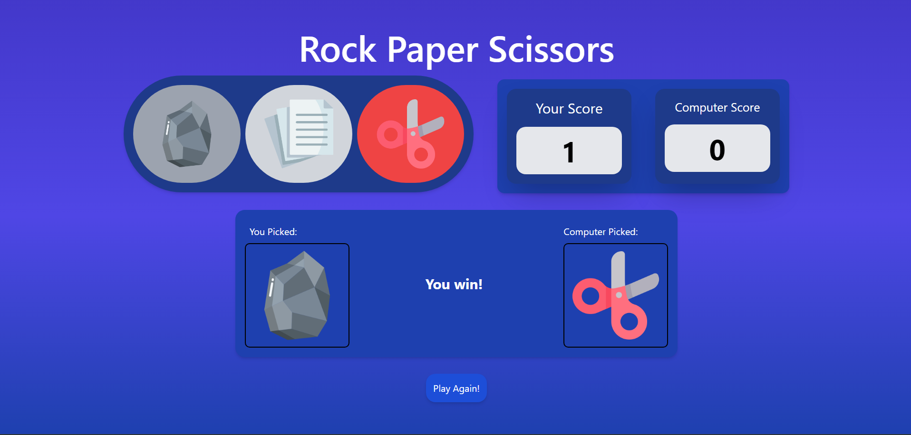

# Rock Paper Scissors Game

This is a simple Rock Paper Scissors game built with HTML, CSS, and JavaScript. It allows the user to play against the computer and keeps track of the score.

## Features

- Play Rock Paper Scissors against the computer.
- Track the user's score and the computer's score.
- Reset the game to play again.

## Technologies Used

## How to Play

1. Choose Rock, Paper, or Scissors by clicking the corresponding button.
2. The computer will randomly select its choice.
3. The winner is determined based on the rules of Rock Paper Scissors:
   - Rock beats Scissors
   - Paper beats Rock
   - Scissors beats Paper
4. The score is updated accordingly.
5. Click the "Play Again!" button to reset the game and start over.

## Preview

## Getting Started

To run the game locally, follow these steps:

1. Clone this repository: `git clone https://github.com/your-username/rock-paper-scissors.git`
2. Open the `index.html` file in your web browser.

